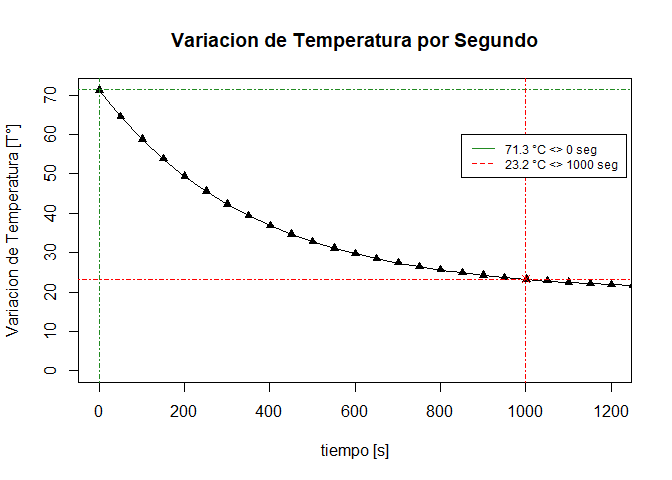
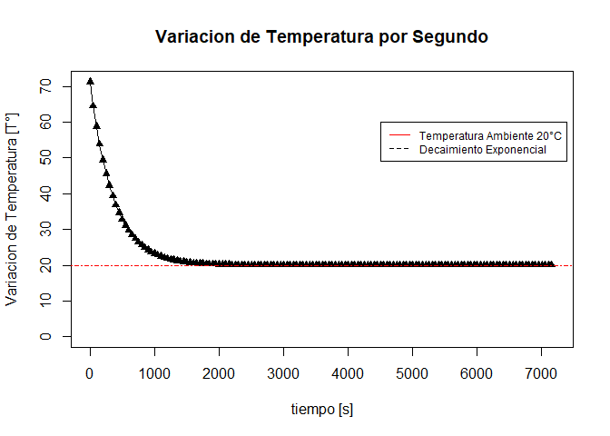

Ecuación de Enfriamiento
================
Diego Morante Suarez
3/1/2022

### DESARROLLO DE SITUACION DE ENFRIAMIENTO

Se halla la constante de enfriamiento *k* con ayuda de temperatura final
e inicial y el tiempo de variacion, en este caso de enfriamiento. Por
otro lado, tambien se podria hallar con la Masa y Área de transferencia
de calor, que son medibles, como tambien de el Coeficiente de
transferencia de calor y Calor especifico.

Temperatura inicial

``` r
T_0 <- 71.3
```

Parámetro de enfriamiento

``` r
k = log((23.2 - 20)/(T_0 - 20))/(-1000)
k
```

    ## [1] 0.00277454

Función:

``` r
t <- seq(1,7200,50)
Temp <- 20 + exp(-0.00277454*t)*(T_0 - 20)
```

Creación de de la ecuación en Rstudio:

``` r
Var_Temp <- function(t, T_0 = c(1:100)){
  VT <- 20 + exp(-0.00277454*t)*(T_0 - 20)
  print(paste("La variación de temperatura para", t, "segundos, es", VT))
  return(VT)
}
```

Probamos la ecuación programada para un t=1000 segundos y una
temperatura de partida o inicial T_0 = 71.3 °C

``` r
Var_Temp(1000, 71.3)
```

    ## [1] "La variación de temperatura para 1000 segundos, es 23.1999998155873"

    ## [1] 23.2

# GRÁFICA DE LA ECUACIÓN DE ENFRIAMIENTO

Grafica para un tiempo transcurrido 0 y 1000 segundos y una temperatura
de partida o inicial T_0 = 71.3 °C

``` r
plot(t, Temp, xlim=c(0, 1200), ylim=c(0, 71.3),
     type = "o", pch = 17,
     xlab = "tiempo [s]", ylab = "Variacion de Temperatura [T°]", 
     main = "Variacion de Temperatura por Segundo")

points(1000, 23.3, pch = 4, col = "red")

abline(h =71.3, v =0,
       lty = 10, 
       col = "forestgreen")

abline(h =23.2, v =1000,
       lty = 10, 
       col = "red")

legend(850, 60 ,c("71.3 °C <> 0 seg ", "23.2 °C <> 1000 seg "), col = c("forestgreen", "red"), 
       lty=1:3, cex=0.75)
```

<!-- -->

Tendencia al largo plazo

``` r
plot(t, Temp, xlim=c(0, 7200), ylim=c(0, 71.3),
     type = "o", pch = 17, col = "black",
     xlab = "tiempo [s]", ylab = "Variacion de Temperatura [T°]", 
     main = "Variacion de Temperatura por Segundo")

abline(h =20, 
       lty = 10, 
       col = "red")

legend(4500, 60 , c("Temperatura Ambiente 20°C", "Decaimiento Exponencial"), 
       col = c("red", "black"),
       lty=1:3, cex=0.75)
```

<!-- -->
